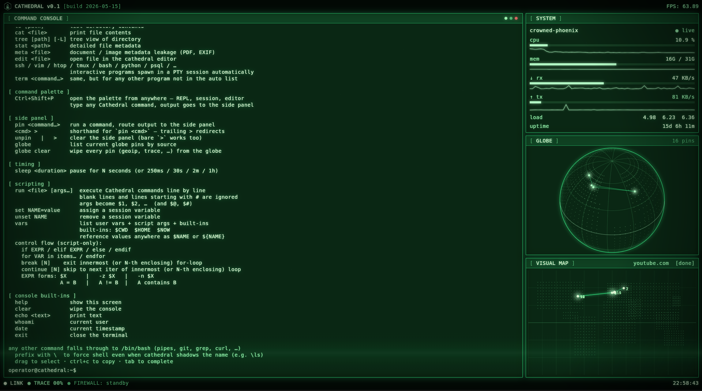

# Cathedral

*by [Crowned Phoenix](https://crowned-phoenix.com) · [YouTube](https://www.youtube.com/@crowned.phoenix)*



Cathedral is a desktop terminal for security operators — a single
application bundling a curated set of recon, audit, and forensics
tools behind a CRT-aesthetic interface. Sparklines, an interactive
globe for geolocated results, and a phosphor finding panel mean the
output of each tool reads at a glance instead of requiring you to
parse columns of text.

This repository is the **Cathedral cookbook**: a per-command
technical reference covering what each tool does, how it works,
what it doesn't do, and where it fits in real workflows. The tools
themselves ship with the Cathedral application; their technique
lives here, in writing.

---

## Why a cookbook

Security tools live or die on whether their behaviour is legible.
A black-box port scanner is useless to a careful operator; a port
scanner with documented method is reusable, auditable, and
trustable.

The cookbook does for Cathedral what RFCs do for protocols: state
what the tool is, how it does its job, what tradeoffs shaped the
design, and the limits worth knowing before relying on it. Each
entry includes the algorithmic kernel as Go snippets — enough to
understand the technique, not enough to be a drop-in replacement
for the tool itself.

This is the open part of Cathedral. The binaries are the licensed
product. Same shape as Burp Suite, Cobalt Strike, and most modern
security-tooling vendors — open technique, licensed
implementation.

---

## Where to start

Thirty-one entries shipped so far. New readers benefit from this
path — it builds understanding from local-self outward:

1. [`netinfo`](netinfo.md) — where am I on the network right now
2. [`ping`](ping.md) — is this host reachable, what shape is the latency
3. [`trace`](trace.md) — what's the path between me and that host
4. [`scan`](scan.md) — what ports are open on this target
5. [`banner`](banner.md) — what's actually listening on one of those ports
6. [`lan-scan`](lan-scan.md) — sweep my LAN for live hosts
7. [`geoip`](geoip.md) — where in the world is an IP, offline
8. [`meta`](meta.md) — what metadata is leaking from this document or image

The rest are in the index below, grouped by category.

Each entry follows the same structure: lead paragraph + usage,
*What it does*, *What it answers*, *How it works* (with code
snippets), *Worked example* (real output), *Output protocol* (the
JSONL event stream), *Limitations*, *Authorized use*, *Further
reading*.

---

## Index by category

### Reachability & transport
Probing whether a target is reachable, how the latency behaves,
and what's actually listening on a port.

- [`ping`](ping.md) — ICMP latency probe with sparkline rendering
- [`trace`](trace.md) — path discovery with geolocation
- [`banner`](banner.md) — single-port banner grab with probe, TLS, and hex dump
- [`ssh-audit`](ssh-audit.md) — SSH server algorithm posture grader

### Discovery
Local-network and host-level enumeration — what's online, what
services are running, what addresses have hostnames, what
conversations are happening on this machine.

- [`netinfo`](netinfo.md) — local network introspection with live sparklines
- [`ports`](ports.md) — local listening sockets and the processes that own them
- [`conns`](conns.md) — active TCP connections with owning process
- [`scan`](scan.md) — TCP port scanner with banner grab
- [`lan-scan`](lan-scan.md) — local subnet sweep with vendor identification
- [`discover`](discover.md) — TCP-ping service inventory across a subnet
- [`wifi`](wifi.md) — wireless network scanner with band, channel, security, vendor

### DNS & identity
Resolving names to addresses and addresses back to names — the
forward and reverse halves of the public DNS view of a target.

- [`dns`](dns.md) — forward DNS lookups for A/AAAA/MX/NS/TXT/CNAME
- [`reverse-dns`](reverse-dns.md) — PTR record sweep across a subnet

### Identification
Who owns this name or address, where is it, what AS does it belong
to. Live registry queries and offline geolocation lookups.

- [`whois`](whois.md) — registry and ownership lookup for domains and IPs
- [`asn`](asn.md) — BGP-table attribution for IPs and hostnames
- [`geoip`](geoip.md) — offline IP geolocation

### Web app analysis
Inspecting websites from the outside — what's running them, what
they expose, what their security posture looks like.

- [`http`](http.md) — terminal HTTP client for recon and probes
- [`recon`](recon.md) — breadth-first HTTP reconnaissance for one target
- [`dirscan`](dirscan.md) — concurrent wordlist-driven path enumerator
- [`headers`](headers.md) — security-header audit with letter grade
- [`cookies`](cookies.md) — Set-Cookie attribute audit
- [`waf`](waf.md) — Web Application Firewall fingerprinting
- [`fav`](fav.md) — favicon hashing for infrastructure pivot
- [`tech`](tech.md) — web technology fingerprinter

### Email & certificates
Mail-authentication policy, MX-host reputation, TLS certificate
posture — the cross-layer view that ties domain authority to
mail and HTTPS trust.

- [`spf`](spf.md) — Sender Policy Framework evaluator with grade A→F
- [`dmarc`](dmarc.md) — DMARC policy evaluator with grade A→F
- [`mx-rep`](mx-rep.md) — MX-host reputation across DNS blocklists
- [`ssl`](ssl.md) — TLS handshake and certificate-chain inspection
- [`crt`](crt.md) — Certificate Transparency log search for subdomain discovery

### File & data forensics
Reading what's inside a file — metadata, embedded artifacts,
integrity properties, hidden payloads.

- [`meta`](meta.md) — document and image metadata extraction
- [`stego`](stego.md) — LSB steganography for PNG carriers

---

## What's planned

Cathedral ships with more tools than the cookbook currently
documents. Entries are added in rough order of how often the tool
is reached for in real workflows. Categories already half-built:

- **Discovery** — `sniff`, `sysmon`
- **DNS & identity** — `dnsbl`
- **Identification** — `oui`
- **Email & certificates** — `subs`
- **Crypto utilities** — `hash`, `pwned`, `entropy`, `bcrypt`,
  `argon2`, `crypt`, `jwt`
- **File & data forensics** — `imgforensic` *(planned)*,
  `browser` *(planned)*
- **Filesystem** — `ls`, `stat`, `tree`

The offensive-tooling section lands later — `crack` (multi-mode
dictionary attack) and `sqli` (SQL injection detection). Those
entries are longer because the authorized-testing posture matters
more and the technique behind each is denser.

---

## Authorized use

Several Cathedral commands are dual-use — useful to defenders for
self-audit and to operators for authorized testing. Each entry's
*Authorized use* section states the specific posture for that
command. The general expectation: target only what you own or have
written permission to test. Cathedral is not a tool for
circumventing detection or evading consent rules.

---

## The product

Cathedral the application is in pre-launch. The cookbook is the
public technical reference and is being written incrementally.

When Cathedral ships, it will be available as a desktop application
for Linux first, macOS and Windows after. Licensing:

- **Personal License** — one-time purchase, for individuals using
  Cathedral on their own systems, for unpaid learning, for CTF, and
  for personal infrastructure auditing.
- **Commercial License** — annual subscription, for security firms,
  managed service providers, and IT departments using Cathedral in
  paid client engagements or at organisational scale.

Pricing, release dates, and the purchase channel will be announced
on [crowned-phoenix.com](https://crowned-phoenix.com) and the
[Crowned Phoenix YouTube channel](https://www.youtube.com/@crowned.phoenix)
when ready.

---

## Reading the cookbook offline

Every entry is self-contained Markdown — no special renderer
required. Clone the repository and read it in any editor, or browse
on GitHub for rendered tables, syntax-highlighted code, and
auto-linked cross-references between entries.

```
git clone https://github.com/crowned-phoenix/cathedral.git
cd cathedral
$EDITOR netinfo.md
```

---

## Versioning

The cookbook is versioned alongside Cathedral itself. Each entry's
frontmatter carries:

- `version-introduced` — the Cathedral release the command first
  shipped in
- `status` — `shipped`, `planned`, or `deprecated`
- `last-updated` — ISO date of the most recent substantive revision

When a command's behaviour changes meaningfully between releases,
the entry is updated and the `last-updated` field bumps. Major
behavioural changes also appear in the [`CHANGELOG`](CHANGELOG.md)
*(planned)*.

---

## Licence

The cookbook itself — every Markdown file in this repository — is
published as open documentation. You may read it, link to it, share
it, and reference its technique freely.

The Cathedral application — the Flutter UI and the Go sidecar
binaries that implement each command — is proprietary software
licensed under terms published at
[crowned-phoenix.com](https://crowned-phoenix.com).
